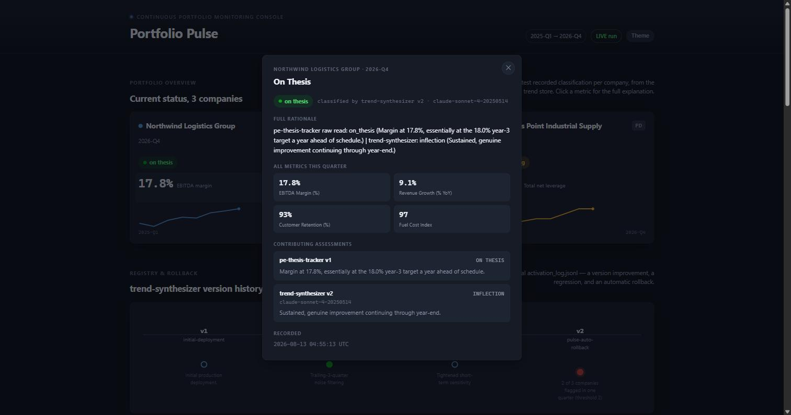
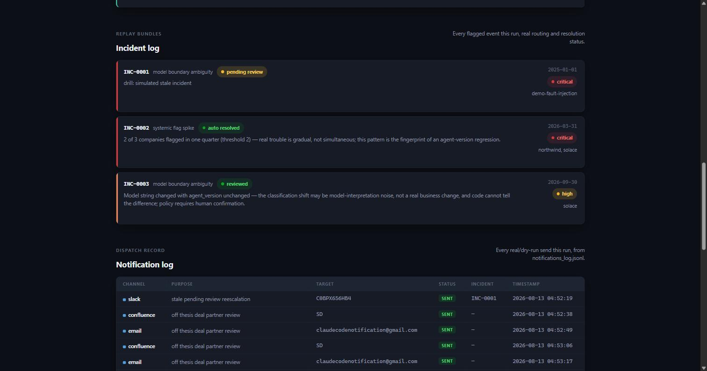
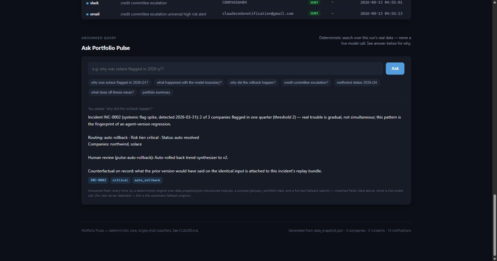

# Stack Sentinel

**A quarterly PE/private-debt portfolio monitoring system built around one constraint: survive
years of prompt edits and model upgrades without corrupting the trend record that gives it any
value at all.**

[](https://github.com/AnikNicks/portfolio-pulse/actions/workflows/ci.yml)
[](https://github.com/AnikNicks/portfolio-pulse/actions/workflows/deploy-pages.yml)
[](https://aniknicks.github.io/portfolio-pulse/)
[](LICENSE)

**[Live dashboard →](https://aniknicks.github.io/portfolio-pulse/)** — no install needed, browse
a real 8-quarter run: three companies, a caught regression with an automatic rollback, a genuine
model-boundary event, and a covenant escalation, all with click-through detail on every figure.


---

## What this is

Most "AI monitoring" demos prove a model can classify one thing well once. This project asks a
different question: what breaks a monitoring system that has to run **every quarter for years**,
long after whoever built it has moved on? Three specific failure modes, each with a real
mechanism defending against it:

- **Prompt/version drift.** A prompt edit that looks like an improvement in isolation can quietly
  regress. → A versioned prompt registry with an automated rollback that requires no human in the
  loop.
- **Silent model-boundary shifts.** A "pinned" version can still resolve to a different model
  snapshot underneath it, and the classification can shift for reasons that have nothing to do
  with the business. → Deterministic boundary detection, unconditionally routed to a human —
  never auto-resolved, regardless of confidence.
- **Unreviewed policy misses.** A routing decision can be technically correct and still miss the
  intent of an escalation clause. → A semantic policy check that runs *alongside* deterministic
  literal counting, not instead of it.

The architectural answer to all three is the same: **push everything that can be deterministic
out of the model entirely.** Version management, the trend store, risk scoring, rollback,
model-boundary detection, and the literal/countable parts of policy compliance are plain,
unit-tested Python with zero LLM involvement. The only places a model is involved are six
single-shot Claude Code subagents — each invoked once, given a bounded context, producing one
JSON classification. Nothing in this system asks a model to plan, loop, or decide whether it
needs more information; see [Project architecture](#project-architecture) for why that
structurally rules out an entire category of agent failure mode.

## Core features

- **Deterministic core, fully unit-tested, zero LLM.** Trend store, risk scoring, model-boundary
  detection, rollback, incident/replay bundles, notification dispatch, schema validation, retry
  policy, and audit logging — all plain Python, all tested without a single model call.
- **Six narrow, single-shot subagents — not planners.** Each is invoked once per company per
  quarter (or once per detected boundary), with a hard tool-call cap and a bounded retrieval
  scope stated in its own prompt. See [Project architecture](#project-architecture).
- **A versioned prompt registry with automatic rollback.** Every classification is stamped with
  the exact agent version and model that produced it — never re-derived later — which is what
  makes reproducing an incident from disk actually possible. See
  [Engineering notes](#engineering-notes) and [`VERSIONING.md`](VERSIONING.md) for two full worked
  scenarios with real numbers from an actual run.
- **Real external connectors, genuinely live.** `pulse/notifications.py` is a real MCP *client*
  that dispatches to an isolated Docker MCP Toolkit profile (Gmail, Slack, Jira, Confluence) —
  dry-run by default, and verified with a real `--live` run: all 14 dispatches sent for real,
  confirmed independently by reading the Gmail inbox back.
- **An interactive dashboard with no invented numbers.** Every figure — trend points, incident
  detail, version history — is click-through to its full underlying record: contributing
  assessments, linked incidents, exact timestamps. Nothing summarized is ungroundable.
- **A grounded Q&A panel that degrades honestly.** A deterministic search engine (glossary +
  portfolio stats + full-text fallback) answers by default; an optional live LLM backend upgrades
  it when you supply your own key, and falls back silently and automatically the instant it isn't
  available — see [Guardrails](#guardrails).

## Live demo

Three companies, one 8-quarter run (2025-Q1 → 2026-Q4), each carrying a different real story:

| Company | Type | Tracked against | What happened |
|---|---|---|---|
| Northwind Logistics Group | PE | Investment thesis (EBITDA margin) | A prompt regression misclassified it `off_thesis` alongside Solace in the same quarter — caught by the systemic-flag-spike rule and **auto-rolled-back**, no human involved (`INC-0002`) |
| Solace Behavioral Health | PE | Investment thesis (same-store revenue growth) | Same prompt version, different underlying model snapshot, one quarter apart — a genuine **model-boundary event**, unconditionally routed to human review (`INC-0003`) |
| Ferrous Point Industrial Supply | PD | Loan covenant (total net leverage) | Pure deterministic math — two consecutive warning-threshold quarters trip the Credit Committee reporting clause, dispatching a real Jira ticket, Confluence page, and Slack post |

Every number on the dashboard is click-through — hover any figure for a quick preview, click for
the full record (all metrics that quarter, every contributing agent's raw read, linked
incidents):

<table>
<tr>
<td></td>
<td></td>
</tr>
</table>

The "Ask Stack Sentinel" panel opens with a real example already answered — try your own
question in the box, or click any of the suggested chips:



**On the live link, this panel runs entirely client-side** — a deterministic engine (structured
lookups, a ~16-term concept glossary, portfolio-wide stats, and a full-text fallback search), not
a live model. That's not a limitation of the demo; it's a hard rule, explained in
[Guardrails](#guardrails).

## Project architecture


Six subagents, each a single-shot classifier with a retrieval scope sized to exactly what its
judgment needs — not "always retrieve everything":

| Agent | Retrieval scope | Invoked | Produces |
|---|---|---|---|
| `pe-thesis-tracker` | Investment thesis, current financials, bounded trend history | Once per PE company per quarter | Raw thesis read (`on_thesis` / `watch` / `off_thesis`) |
| `pd-covenant-tracker` | Loan agreement, current financials, bounded trend history | Once per PD company per quarter | Trajectory commentary only — the `compliant`/`warning`/`breach` label itself is pure Python |
| `trend-synthesizer` | Last 4–6 quarters of trend history | Once per company per quarter, PE and PD alike | Noise-vs-inflection verdict — the noise-filter gate on PE's final classification |
| `model-boundary-interpreter` | Exactly the two trend entries bracketing a detected boundary | Only when `model_boundary.py` already deterministically found one | Business-change vs. model-interpretation-noise judgment |
| `portfolio-rollup-writer` | Latest entry per company, portfolio-wide | Once per reporting cycle | One cross-company report |
| `policy-compliance-checker` | Policy corpus only — **deliberately no trend history at all** | Once per routing decision needing a policy check | Borderline "intent of the clause" judgment |

That last row is the clearest example in this system of *excluding* memory on purpose, not just
bounding it — pulling episodic trend data into a policy-compliance judgment adds noise, not
signal, to the question "does this routing satisfy policy." Full memory-model mapping (working /
episodic / semantic / and the deliberate absence of procedural memory) is in
[`MEMORY.md`](MEMORY.md).

Nothing here asks a subagent to plan, loop, or request more context — each has exactly one turn,
a hard cap on tool calls stated in its own prompt, and one required JSON output shape. The
loop-detection and scope-creep machinery a multi-step planning agent needs doesn't apply here: a
single-shot classifier structurally cannot re-explore ground or escalate its own scope. See
[`CLAUDE.md`](CLAUDE.md) for the full reasoning.

## Guardrails

Stated honestly — what's enforced by code versus what's prompt-level discipline.

**Enforced in code:**
- Every trend entry is stamped with the exact `classifying_agent` / `agent_version` / `model`
  that produced it, never re-derived from a later registry lookup — the record of "what produced
  this" travels with the data, which is what makes reproducing an incident from disk possible.
- `pulse/soft_fix.py` contains exactly one function and nothing else, by design — reverting to a
  previously-live version is the only automated remediation action anywhere in this system.
- Model-boundary findings route to `human_review` unconditionally — no code path lets one
  auto-resolve, regardless of confidence.
- Missing or malformed agent output gets exactly one defined fallback (`assessment_failed`),
  written once — never retried indefinitely, never silently skipped.
- No agent that reads untrusted content (financials, policy text, trend history) also holds a
  write-capable tool in the same turn. `append_trend_entry` and the real Gmail/Jira/
  Confluence/Slack tools are called only by the orchestration layer, using an agent's *validated
  structured output* — never raw agent text.
- A failed live send fails loudly with the real error, never silently claims `"sent"` — verified
  by deliberately running `--live` against an uncredentialed profile: all 14 attempts failed with
  specific, honest per-channel reasons.
- The optional live-LLM Q&A backend runs at `temperature=0`, is grounded by passing the real run
  data as context, and its system prompt explicitly refuses to answer outside that data or follow
  instructions embedded in the user's question. PII patterns (email/SSN/card/phone) are redacted
  on both the outgoing question and the incoming answer, server-side, before either ever leaves
  the machine.

**Convention-level (prompt discipline, not sandboxed):**
- Every agent's prompt states a hard cap on tool calls per invocation.
- Each agent's tool definitions carry a one-sentence retrieval-scope comment sized to its actual
  judgment — see the table above.
- No secret is ever visible to, or passed through, the assistant. Docker MCP credentials live only
  in the OS keychain (`docker mcp secret set`); the OpenAI key lives only in a gitignored `.env`,
  read exclusively by server-side code that never logs or echoes it.

## Engineering notes

Real issues found and fixed while building and running this system — not staged for the README:

- **A false-positive rule scoped too broadly, found during the actual simulation run.** The
  systemic-flag-spike check originally counted *any* flagged company, including PD covenant
  warnings — which produced a false spike when Ferrous Point's genuine covenant warning
  coincided with Solace's model-boundary flag in the same quarter. Fixed by scoping the spike
  count to `classifying_agent == "trend-synthesizer"` only, since PD's deterministic covenant math
  can never be evidence of an agent-version regression by construction — proven by a dedicated
  test that a single genuine PD flag across multiple quarters never triggers a spike.
- **A Windows-only subprocess bug that silently broke real `--live` sends.** `notifications.py`
  spawns `docker mcp gateway run` through the `mcp` SDK's `stdio_client`, which restricts the
  child process to a small env-var allowlist on Windows — one missing `ProgramFiles` (which
  Docker's CLI needs to discover the `mcp` plugin at all) and `ProgramData` (which the
  `docker-mcp` binary itself panics without, reading Docker Desktop's admin settings). Found by
  reproducing the exact subprocess call in isolation with the SDK's real restricted environment,
  confirmed by diffing `docker mcp --help` output with and without each variable present. Fixed
  with a small Windows-only env-var supplement, verified first with a harmless read-only call
  before touching anything that actually sends.
- **Silent-truncation risk in the live-LLM answer path.** The optional OpenAI backend originally
  capped answers at 400 tokens with no signal when a response was cut off mid-sentence. Raised the
  cap, and — more importantly — made a cutoff explicit in the answer text instead of silent, same
  "never silently claim success" discipline as the rest of the system, verified with a deliberate
  worst-case prompt designed to exceed it.
- **A real chart-overflow bug and a mojibake bug**, both found by actually rendering the dashboard
  in a browser rather than trusting the HTML: an SVG grid item needed `min-width: 0` to stop
  overflowing its card at narrow widths, and a missing charset declaration was mangling em-dashes
  into garbled bytes.

## Tech stack

| Layer | Choice |
|---|---|
| Agents & orchestration | Claude Code subagents (`.claude/agents/*.md`) + a plain-Python orchestrator — no agent framework |
| Deterministic core | Python 3.12, zero LLM calls (`pulse/*.py`) |
| MCP server | `mcp` SDK v2.0.0 (`mcp_server/server.py` + `tools_impl.py`), 7 tools, schema-verified |
| Vector store | chromadb, default local embedding model — no external API key needed |
| Real external connectors | Docker MCP Toolkit (`gmail-mcp`, `atlassian`, `slack`), driven by a real MCP client in `pulse/notifications.py` |
| Optional live Q&A | OpenAI Chat Completions (`gpt-4o-mini`, `temperature=0`) via a small stdlib HTTP server — the one non-Anthropic model call anywhere in this repo |
| Dashboard | Self-contained HTML/CSS/vanilla JS — no build step, no framework, no external font/CDN calls |
| Tests | pytest + a framework-free fallback (`tests/run_tests.py`) |
| CI / hosting | GitHub Actions (pytest on every push) + GitHub Pages (static dashboard) |

## Repository structure

```
.claude/agents/           six subagent definitions — single-shot classifiers, not planners
pulse/                    deterministic core: trend store, risk scoring, rollback, notifications
mcp_server/                MCP server (server.py) + real tool implementations (tools_impl.py)
registry/<agent>/          versioned prompt bundles (v1.yaml, v2.yaml, ...) + active.yaml
policy/                    monitoring_escalation_policy.md + chromadb persistence (gitignored)
data/                      portfolio_companies.json, financials/, trend_store/, incidents/
scripts/                   seed_registry.py, simulate_production_run.py, investigate_incident.py, ...
dashboard/                 dashboard.html (self-contained) + ask_server.py (optional live backend)
tests/                     pytest suite + framework-free run_tests.py
docs/screenshots/          README screenshots
.github/workflows/         CI (pytest) + GitHub Pages deploy
CLAUDE.md, MEMORY.md, VERSIONING.md   architecture, memory-model, and rollback docs
```

## Getting started

```bash
# 1. Install
python -m venv .venv
.venv\Scripts\pip install -r requirements.txt      # Windows
# .venv/bin/pip install -r requirements.txt         # macOS/Linux

# 2. Seed the registry + policy corpus (idempotent, safe to re-run)
.venv\Scripts\python scripts\seed_registry.py
.venv\Scripts\python -c "from pulse import vector_store; vector_store.ingest_policy_corpus()"

# 3. Run the simulation — 8 quarters x 3 companies, fresh state
.venv\Scripts\python scripts\simulate_production_run.py --reset
#   add --live to fire real Gmail/Slack/Jira/Confluence notifications — requires your own
#   Docker MCP Toolkit profile and credentials, never checked into this repo (see .env.example)

# 4. Tests
.venv\Scripts\python -m pytest tests\ -v

# 5. Dashboard
.venv\Scripts\python scripts\export_dashboard_data.py
.venv\Scripts\python dashboard\build_dashboard.py
# then open dashboard/dashboard.html directly, or:
.venv\Scripts\python dashboard\ask_server.py
#   optional — add your own OPENAI_API_KEY to .env for a live-model Q&A panel;
#   without it, the dashboard's deterministic engine still answers everything,
#   just without a live model behind it
```

## Roadmap

- The six subagents are spec-verified (frontmatter, retrieval scopes, tool caps, JSON contracts)
  but have never been invoked over a live `claude` CLI round-trip in this build —
  `simulate_production_run.py` feeds scripted stand-in classifications into the real
  orchestrator/risk-scoring/notification pipeline; only the classification *text* is scripted,
  every failure path, idempotency check, and routing decision downstream of it is real.
- Run against more than 8 quarters and more than 3 companies to see how the noise-filter gate and
  rollback mechanism hold up at real portfolio scale.
- A small hosted backend for the live-LLM Q&A panel, so the public demo can stay live-model-backed
  persistently instead of local-only by design (a static site can never hold an API key safely).

## License

[MIT](LICENSE)
