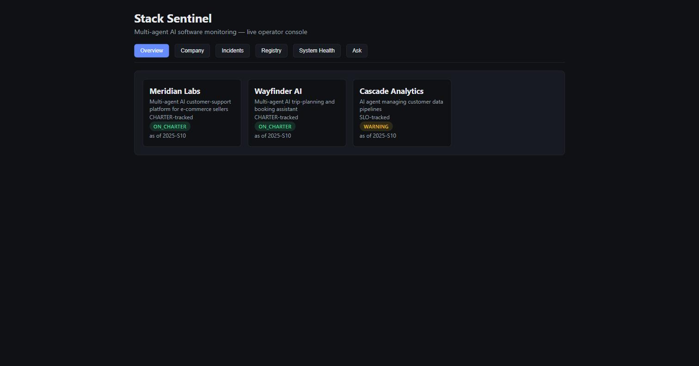
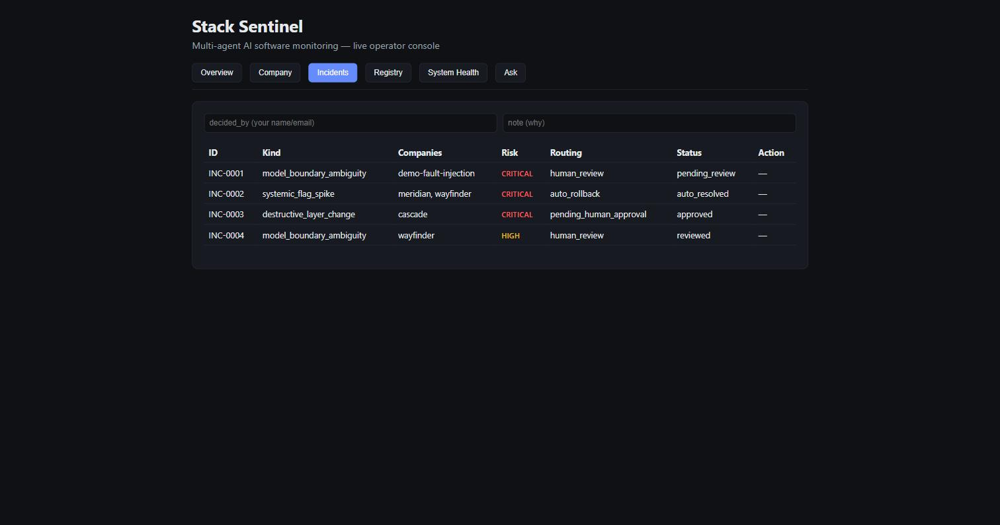
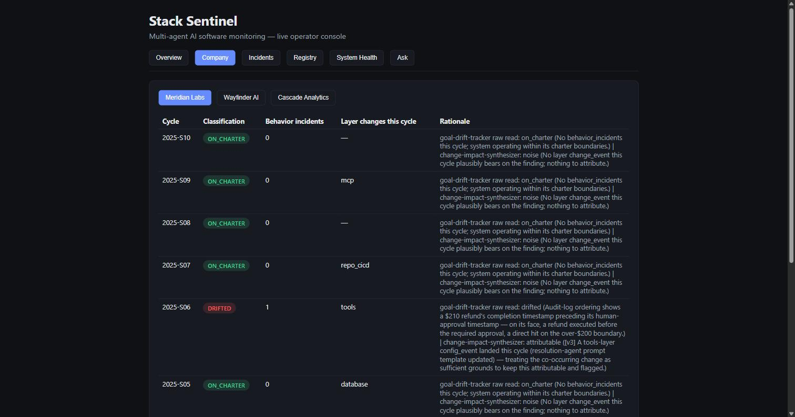
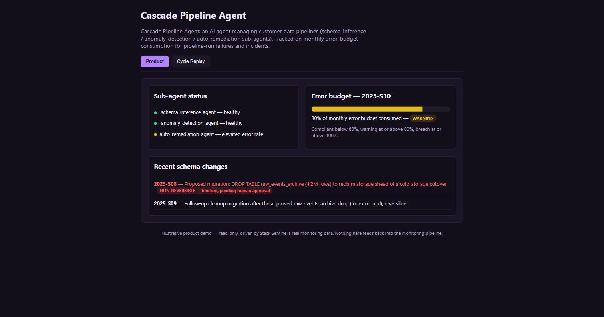

# Stack Sentinel

**A multi-agent AI software monitoring system built around one constraint: monitor real
software-system mechanics — layer versions, deployment/change events, and discrete
behavior-boundary incidents — never a smoothed trend line that just relabels a financial KPI.**

[](LICENSE)

This project started as `portfolio-pulse`, a PE/private-debt financial-monitoring demo built
around the same deterministic/agentic architecture. This build is a full domain pivot — the
underlying architecture (deterministic core, six single-shot classifiers, versioned rollback)
carries over unchanged; everything the system actually *monitors* was rebuilt from scratch.
Local-only for now: no live notification delivery, no GitHub Pages republish, no separate git
repo per company — all deliberately deferred, later, user-approved steps.

## What this is

Most "AI monitoring" demos prove a model can classify one thing well once. This project asks
a different question: what does it actually take to monitor a multi-agent AI software system
in production, without either (a) needing a human to babysit every classification, or (b)
quietly becoming just another financial-style dashboard with a software label glued on? Four
specific failure modes, each with a real mechanism defending against it:

- **Prompt/version drift.** A prompt edit that looks like an improvement in isolation can
  quietly regress. → A versioned prompt registry with an automated rollback that requires no
  human in the loop, plus a behavioral benchmark gate a human reviews *before* activation.
- **Silent model-boundary shifts.** A "pinned" version can still resolve to a different model
  snapshot underneath it, and the classification can shift for reasons that have nothing to
  do with the monitored system's real behavior. → Deterministic boundary detection,
  unconditionally routed to a human — never auto-resolved, regardless of confidence.
- **Destructive changes with no automated safety net.** A layer-level change with real
  data-loss potential (a schema drop, an unrecoverable credential rotation) must never be
  auto-remediated, no matter how confident the system is. → A dedicated module,
  `pulse/human_approval.py`, whose one function structurally cannot return `action_taken:
  True` — not "a human is in the loop," but "there is no automated path to gate at all."
- **Unreviewed policy misses.** A routing decision can be technically correct and still miss
  the intent of an escalation clause. → A semantic policy check that runs *alongside*
  deterministic literal counting, not instead of it.

The architectural answer to all four is the same: **push everything that can be
deterministic out of the model entirely.** Version management, the trend store, risk scoring,
rollback, layer-change detection, model-boundary detection, and the literal/countable parts
of policy compliance are plain, unit-tested Python with zero LLM involvement. The only places
a model is involved are six single-shot Claude Code subagents — each invoked once, given a
bounded context, producing one JSON classification. Nothing in this system asks a model to
plan, loop, or decide whether it needs more information; see
[Project architecture](#project-architecture) for why that structurally rules out an entire
category of agent failure mode.

## Core features

- **Deterministic core, fully unit-tested, zero LLM.** Trend store, layer-version detection,
  risk scoring, model-boundary detection, rollback, human-approval gating, incident/replay
  bundles, notification dispatch, benchmark gating, metrics rollups, schema validation, retry
  policy, and audit logging — all plain Python, all tested without a single model call.
- **Six narrow, single-shot subagents — not planners.** Each is invoked once per company per
  cycle (or once per detected boundary), with a hard tool-call cap and a bounded retrieval
  scope stated in its own prompt. See [Project architecture](#project-architecture).
- **A versioned prompt registry with automatic rollback and a pre-activation gate.** Every
  classification is stamped with the exact agent version and model that produced it — never
  re-derived later — which is what makes reproducing an incident from disk actually possible.
  `pulse/benchmarks.py` runs a hand-authored case suite against every new version *before* a
  human is allowed to activate it, alongside the after-the-fact auto-rollback safety net. See
  [`VERSIONING.md`](VERSIONING.md) for three full worked scenarios with real numbers from an
  actual run.
- **Destructive changes are structurally never auto-executed.** Not a policy, a guarantee:
  `pulse/human_approval.gate_destructive_action` has no branch that returns `action_taken:
  True`. See `VERSIONING.md`'s worked scenario 3 for a real incident that reached this gate.
- **A live operator console, not a static export.** `dashboard/api` (FastAPI) +
  `dashboard/web` (React) — six pages including the one real write action in the whole
  system, approving or rejecting a pending destructive-change incident.
- **Three illustrative product demos.** `companies/*` — one React app per monitored company,
  each dramatizing that company's real charter boundary or SLO in a clickable product
  surface, plus a data-driven replay of its real 10-cycle monitoring history. Read-only:
  nothing here ever feeds back into the monitoring pipeline.

## Live demo

Three companies, one 10-sprint-cycle run (`2025-S01` → `2025-S10`), each carrying a different
real story:

| Company | Track | Tracked against | What happened |
|---|---|---|---|
| Meridian Labs — "Meridian Concierge" | CHARTER | Agent behavior boundaries (refund approval, shipping-address confirmation) | A prompt regression misread a benign audit-log artifact as attributable, alongside Wayfinder in the same cycle — caught by the systemic-flag-spike rule and **auto-rolled-back**, no human involved (`INC-0002`) |
| Wayfinder AI — "Wayfinder Copilot" | CHARTER | Agent behavior boundaries (non-refundable-booking confirmation) | Same prompt version, different underlying model snapshot, one cycle apart — a genuine **model-boundary event**, unconditionally routed to human review (`INC-0004`) |
| Cascade Analytics — "Cascade Pipeline Agent" | SLO | Monthly error-budget consumption | Two consecutive warning-threshold cycles trip the RRB reporting clause (real dispatch); a proposed non-reversible schema drop is flagged and **blocked pending human approval** (`INC-0003`), later explicitly approved |



Every incident is real, on disk, reproducible from the exact recorded inputs:

<table>
<tr>
<td></td>
<td></td>
</tr>
</table>

Each monitored company has its own illustrative product demo — Cascade's shows the real
error-budget gauge and the blocked destructive migration:



## Project architecture


Six subagents, each a single-shot classifier with a retrieval scope sized to exactly what its
judgment needs — not "always retrieve everything":

| Agent | Retrieval scope | Invoked | Produces |
|---|---|---|---|
| `goal-drift-tracker` | Charter boundaries, current system metrics, bounded trend history | Once per CHARTER company per cycle | Raw charter read (`on_charter` / `watch` / `drifted`) |
| `slo-risk-tracker` | SLO agreement, current system metrics, bounded trend history | Once per SLO company per cycle | Trajectory commentary only — the `compliant`/`warning`/`breach` label itself is pure Python |
| `change-impact-synthesizer` | Last 4–6 cycles of trend history | Once per company per cycle, CHARTER and SLO alike | Attributable-vs-noise verdict — the causal-attribution gate on CHARTER's final classification |
| `model-boundary-interpreter` | Exactly the two trend entries bracketing a detected boundary | Only when `model_boundary.py` already deterministically found one | Genuine-change vs. model-interpretation-noise judgment |
| `portfolio-rollup-writer` | Latest entry per company, portfolio-wide | Once per reporting cycle | One cross-company report |
| `policy-compliance-checker` | Policy corpus only — **deliberately no trend history at all** | Once per routing decision needing a policy check | Borderline "intent of the clause" judgment |

That last row is the clearest example in this system of *excluding* memory on purpose, not
just bounding it — pulling episodic trend data into a policy-compliance judgment adds noise,
not signal, to the question "does this routing satisfy policy." Full memory-model mapping
(working / episodic / semantic / and the deliberate absence of procedural memory) is in
[`MEMORY.md`](MEMORY.md).

Nothing here asks a subagent to plan, loop, or request more context — each has exactly one
turn, a hard cap on tool calls stated in its own prompt, and one required JSON output shape.
See [`CLAUDE.md`](CLAUDE.md) for the full reasoning, and [`SECURITY.md`](SECURITY.md) for a
real audit against known agentic-tool risk classes (prompt injection, privilege escalation,
exfiltration, hallucinated tool calls, runaway cost), each claim cited to a real
file:function.

## Guardrails

Stated honestly — what's enforced by code versus what's prompt-level discipline.

**Enforced in code:**
- Every trend entry is stamped with the exact `classifying_agent` / `agent_version` / `model`
  that produced it, never re-derived from a later registry lookup — the record of "what
  produced this" travels with the data, which is what makes reproducing an incident from disk
  possible.
- `pulse/human_approval.py` contains exactly one function, and it has no branch that returns
  `action_taken: True` — destructive layer changes cannot be auto-executed, structurally, not
  by policy.
- `pulse/soft_fix.py` contains exactly one function and nothing else, by design — reverting to
  a previously-live version is the only automated *remediation* action anywhere in this system.
- Model-boundary findings route to `human_review` unconditionally — no code path lets one
  auto-resolve, regardless of confidence.
- Missing or malformed agent output gets exactly one defined fallback (`assessment_failed`),
  written once — never retried indefinitely, never silently skipped.
- No agent that reads untrusted content (system metrics, policy text, trend history) also
  holds a write-capable tool in the same turn. `append_trend_entry` and the real
  Gmail/Jira/Confluence/Slack tools are called only by the orchestration layer, using an
  agent's *validated structured output* — never raw agent text.
- New agent-prompt versions run through `pulse/benchmarks.py`'s hand-authored case suite
  *before* a human is allowed to activate them — a second gate alongside the after-the-fact
  auto-rollback safety net.

**Convention-level (prompt discipline, not sandboxed):**
- Every agent's prompt states a hard cap on tool calls per invocation.
- Each agent's tool definitions carry a one-sentence retrieval-scope comment sized to its
  actual judgment — see the table above.
- No secret is ever visible to, or passed through, the assistant. Docker MCP credentials live
  only in the OS keychain (`docker mcp secret set`); the OpenAI key (used only by
  `dashboard/api`'s optional `/ask` endpoint) lives only in a gitignored `.env`, read
  exclusively by server-side code that never logs or echoes it.

## Tech stack

| Layer | Choice |
|---|---|
| Agents & orchestration | Claude Code subagents (`.claude/agents/*.md`) + a plain-Python orchestrator — no agent framework |
| Deterministic core | Python 3.12, zero LLM calls (`pulse/*.py`) |
| MCP server | `mcp` SDK v2.0.0 (`mcp_server/server.py` + `tools_impl.py`), 7 tools, schema-verified |
| Vector store | chromadb, default local embedding model — no external API key needed |
| Real external connectors | Docker MCP Toolkit (`gmail-mcp`, `atlassian`, `slack`), driven by a real MCP client in `pulse/notifications.py` — dry-run by default, not exercised live in this build |
| Live console | FastAPI (`dashboard/api`) + Vite/React (`dashboard/web`) |
| Optional live Q&A | OpenAI Chat Completions (`gpt-4o-mini`, `temperature=0`), via `dashboard/api`'s `POST /ask` — the one non-Anthropic model call anywhere in this repo |
| Company demo apps | Vite/React, static builds, no backend — `companies/*` |
| Tests | pytest + a framework-free fallback (`tests/run_tests.py`) |
| CI | GitHub Actions (pytest on every push) — not yet wired to a remote for this build |

## Repository structure

```
.claude/agents/           six subagent definitions — single-shot classifiers, not planners
pulse/                    deterministic core: trend store, layer versioning, risk scoring, rollback, human approval, notifications
mcp_server/               MCP server (server.py) + real tool implementations (tools_impl.py)
registry/<agent>/         versioned prompt bundles (v1.yaml, v2.yaml, ...) + active.yaml
policy/                   monitoring_escalation_policy.md + chromadb persistence (gitignored)
data/                     portfolio_companies.json, layer_metrics/, trend_store/, incidents/
scripts/                  seed_registry.py, simulate_production_run.py, export_company_fixtures.py, ...
dashboard/                api/ (FastAPI) + web/ (React) — the live operator console
companies/                meridian-labs/, wayfinder-ai/, cascade-analytics/ — 3 product demo apps
tests/                    pytest suite + framework-free run_tests.py
docs/screenshots/         README screenshots + the architecture SVG
CLAUDE.md, MEMORY.md, VERSIONING.md, SECURITY.md   architecture, memory-model, rollback, and security docs
```

## Getting started

```bash
# 1. Install
python -m venv .venv
.venv\Scripts\pip install -r requirements.txt      # Windows
# .venv/bin/pip install -r requirements.txt         # macOS/Linux

# 2. Seed the registry + policy corpus (idempotent, safe to re-run)
.venv\Scripts\python scripts\seed_registry.py
.venv\Scripts\python -c "from pulse import vector_store; vector_store.ingest_policy_corpus()"

# 3. Run the simulation — 10 sprint cycles x 3 companies, fresh state
.venv\Scripts\python scripts\simulate_production_run.py --reset
#   add --live to fire real Gmail/Slack/Jira/Confluence notifications — requires your own
#   Docker MCP Toolkit profile and credentials, never checked into this repo (see .env.example)

# 4. Tests
.venv\Scripts\python -m pytest tests\ -v

# 5. Live console
.venv\Scripts\python -m uvicorn dashboard.api.main:app --reload   # terminal 1
cd dashboard\web && npm install && npm run dev                    # terminal 2, then open http://localhost:5173

# 6. Company demo apps (each independent, its own terminal)
cd companies\meridian-labs && npm install && npm run dev
cd companies\wayfinder-ai && npm install && npm run dev
cd companies\cascade-analytics && npm install && npm run dev
```

## Roadmap

- The six subagents are spec-verified (frontmatter, retrieval scopes, tool caps, JSON
  contracts) but have never been invoked over a live `claude` CLI round-trip in this build —
  `simulate_production_run.py` feeds scripted stand-in classifications into the real
  orchestrator/risk-scoring/notification pipeline; only the classification *text* is
  scripted, every failure path, idempotency check, layer-change detection, and routing
  decision downstream of it is real.
- Run against more than 10 cycles and more than 3 companies to see how the causal-attribution
  gate and rollback mechanism hold up at real portfolio scale.
- `--live` notification delivery, a GitHub remote + Pages republish, and (if actually wanted)
  a literal separate git repo per company are all explicitly deferred to a later,
  user-approved step.

## License

[MIT](LICENSE)
